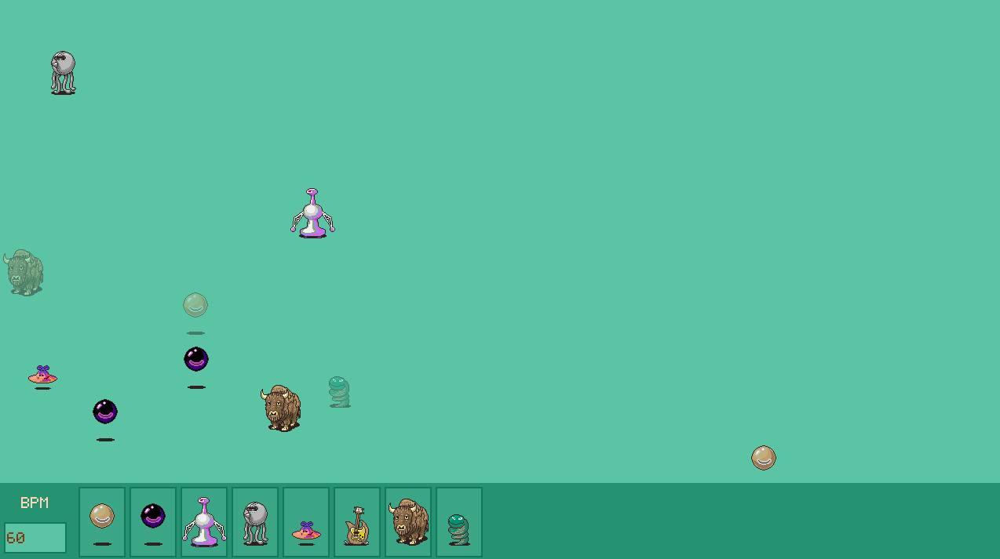

# Songtide



Songtide is an interactive platform designed for exploring and experimenting with various music generation algorithms. It offers a diverse selection of monsters, each with its own unique sound and instrument. By adjusting the parameters and positioning of the monsters on the screen, users can create their own distinct melodies and compositions.

## Technologies Used

Songtide is built using the following technologies:

- Python version 3.11.3
- Pygame for the front-end interface
- Pygame GUI for user interface components
- PyFluidSynth for the back-end sound engine

## Getting Started

To get started with Songtide, follow the steps below:

### Prerequisites

Ensure that you have the necessary prerequisites installed:

1. Install the basic requirements for Pygame and Pygame GUI by running the following command:

    ```bash
    pip install -r requirements/base.txt
    ```

2. Install PyFluidSynth by following the instructions provided [here](https://github.com/nwhitehead/pyfluidsynth)

### Running the Project

1. Configure the `.env` file by making a copy of the `.env.template` file and filling in the required values. Update the `MIDI_DRIVER` and `AUDIO_DRIVER` values according to your specific driver configuration.

2. Run the following command to start the project:

```bash
python -m src
```

## Usage

Select a monster from the main control bar located at the bottom of the screen. Simply left-click and drag the desired monster onto the field.

Control the pitch of the monster by adjusting its horizontal position on the field. 
Modify the volume of the monster by adjusting its vertical position on the field.

For more advanced options, right-click on a monster within the field. This will open a menu that provides access to the monster's parameters, allowing you to fine-tune its sound. Additionally, you can choose to mute or remove the monster from the field using the available options.

Utilize the bottom control bar to manipulate the beats per minute (BPM) of the composition. Adjust the BPM to control the overall tempo and rhythm of the music.

Experiment with different monster selections, positions, parameters, and BPM settings to create your unique musical compositions.

## Acknowledgements

The soundfonts used in Songtide were extracted from the game "Earthbound" and can be found [here](https://www.williamkage.com/snes_soundfonts/). The monster sprites were also extracted from the "Earthbound" game and can be found [here](https://www.spriters-resource.com/snes/earthbound/).